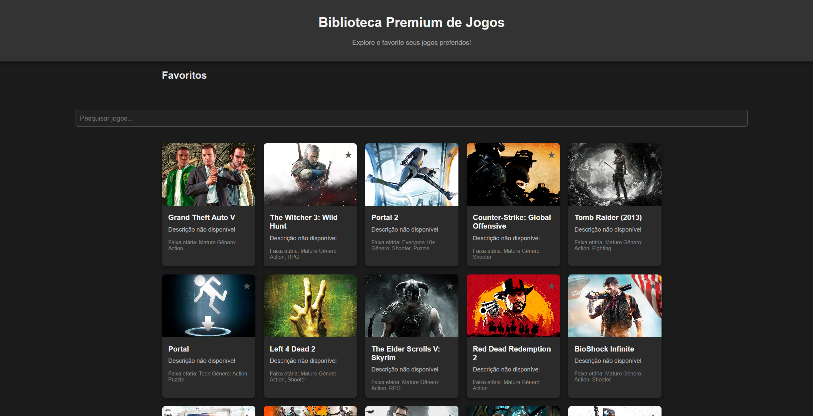

# Biblioteca de Jogos 🎮

Bem-vindo à Biblioteca de Jogos! Este é um projeto de uma aplicação web construída com [Phoenix](https://www.phoenixframework.org/) e Elixir que permite explorar uma vasta coleção de jogos, visualizar informações detalhadas e marcar favoritos.

## Funcionalidades 🕹️

### Exploração de Jogos
- **Biblioteca de Jogos**: Exibe uma coleção de jogos populares, com título, imagem, descrição, faixa etária e gênero.
- **Favoritos**: Marque os jogos como favoritos clicando no ícone de estrela. Os jogos favoritos são exibidos em uma seção especial para fácil acesso.

### Pesquisa
- **Barra de Pesquisa**: Pesquise um jogo específico por nome. Conforme você digita, a lista é filtrada automaticamente para mostrar apenas os jogos que correspondem à busca.

### Interface Premium
- **Design Inspirado em Plataformas**: O layout foi criado com uma interface escura, inspirada em bibliotecas de jogos como Steam e PlayStation.

## Capturas de Tela 📸

### Página Inicial

## Tecnologias Usadas 🚀

- **Elixir** e **Phoenix Framework** para o backend.
- **HTML e CSS** com uso de **HEEx** para renderização de templates dinâmicos.
- **JavaScript** para controle do frontend (favoritos e pesquisa).

## Pré-requisitos

- **Elixir** e **Erlang** instalados
- **Phoenix Framework** e **Node.js**

## Passo a Passo para Rodar a Aplicação 🛠️

1. **Clone o Repositório**:

   git clone https://github.com/seu-usuario/biblioteca-premium-jogos.git
   cd biblioteca-premium-jogos

2. **Instale as Dependências**:

  mix deps.get

3. **Rodando**:

  mix phx.server
  Acesse a aplicação em http://localhost:4000.

## Estrutura do Código 📂

  - lib/: Contém a lógica principal da aplicação.
  - biblioteca_jogos_web/controllers/: Controladores que lidam com as rotas e lógica.
  - biblioteca_jogos_web/templates/: Templates .heex com estrutura HTML da aplicação.
  - assets/css/app.css: Arquivo de estilos para o design da interface.